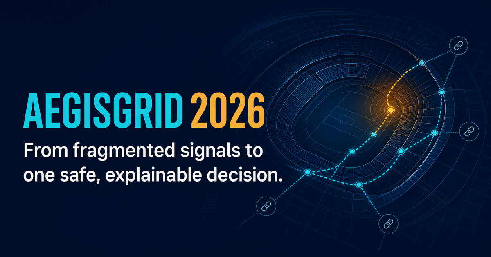
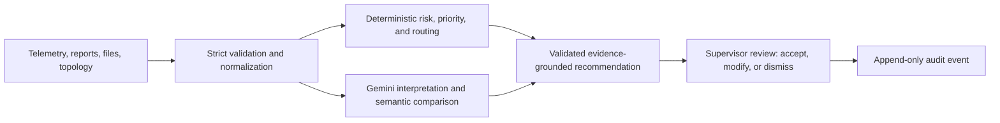

# AEGISGRID 2026

**Explainable Incident Fusion & Response Copilot for Stadium Safety Supervisors**

[](https://github.com/abhijithbhat/aegisgrid-2026/actions/workflows/ci.yml)
[](https://github.com/abhijithbhat/aegisgrid-2026/actions/workflows/codeql.yml)
[](LICENSE)



**Cloud Run production preview:** [https://aegisgrid-2026-799660927467.us-central1.run.app](https://aegisgrid-2026-799660927467.us-central1.run.app) · [Secondary development preview](https://aegisgrid-2026.abhijithhubli129918.chatgpt.site) · [Seven-minute judge walkthrough](docs/judge-demo.md) · [Architecture](docs/architecture.md) · [Security policy](SECURITY.md)

> From fragmented signals to one safe, explainable decision.

AegisGrid converts noisy crowd telemetry, multilingual reports, venue topology, team availability, and uncertain observations into one prioritized, evidence-grounded recommendation for a trained **stadium safety supervisor**. It supports Operational Intelligence and Real-Time Decision Support; it does not autonomously dispatch responders or replace venue procedures.

The product uses a synthetic venue—**Unity Stadium 2026**—and original interface assets. It contains no official tournament, venue, club, or federation branding.

## Seven-minute judge path

1. Open **Command** and read the Priority 01 decision brief: incident, deterministic risk, evidence, conflicts, recommended team, safe-route ETA, and the explicit human-approval boundary.
2. Open the selected incident and compare the deterministic score with the validated AI classification. Inspect cited source IDs, contradictions, uncertainty, and clarifying questions.
3. Open **Data Lab**, stage a CSV/JSON/PDF or direct report, review the proposed schema mapping, edit it, validate it, and explicitly approve the normalized rows.
4. Run **Accessible Corridor Blockage** in the Simulator with seed `2026`; confirm that the deterministic router avoids blocked and stair-only paths.
5. Open **Audit** and verify the append-only actor, state transition, note, and recommendation/route version trail.

For an offline or no-key review, leave `GEMINI_API_KEY` empty. The honest degraded state is intentional and demonstrates exactly which decisions require generative AI.

## What judges can prove

- A synthetic scenario feed drives readiness, occupancy, flows, incidents, and sensor health from shared application state.
- A real binary max-priority queue orders incidents (`peek O(1)`, insert/remove `O(log n)`).
- The incident intelligence view separates a transparent deterministic risk score from AI severity and explains disagreement.
- Supporting source IDs, contradictions, missing information, clarifying questions, uncertainty, team/equipment, action order, and communication remain inspectable.
- CSV, JSON, PDF, and direct text enter a staged Data Injection Lab: inspect → map → approve → edit → validate → import.
- Every mapping is visible; uncertain mappings are never silently applied. Validation reports are downloadable.
- A*/Dijkstra routing over a weighted adjacency-list graph calculates primary, alternate, and naive-distance routes. The LLM never invents a path.
- Five reproducible scenarios mutate the same state: West Gate Surge, Conflicting Smoke Reports, Multilingual Medical Incident, Accessible Corridor Blockage, and False Duplicate Challenge.
- Accept/Modify/Dismiss, team assignment, step completion, notes, and resolution create append-only audit events. “Accept” means supervisor approval—not dispatch.

## Hybrid AI architecture

| Deterministic code owns                           | Gemini owns                                        |
| ------------------------------------------------- | -------------------------------------------------- |
| Numeric validation and normalization              | Interpreting unstructured incident reports         |
| 0–100 risk arithmetic and factor breakdown        | Comparing plausible cross-language duplicates      |
| Binary-heap ordering                              | Synthesizing contradictions and uncertainty        |
| Graph routing and dynamic edge costs              | Proposing unfamiliar-schema mappings               |
| File limits, server-set audit actors, persistence | Drafting audience- and urgency-aware announcements |
| Runtime schema validation and source-ID checks    | Producing minimum high-value clarifying questions  |



AI responses use a strict structured contract, current official `@google/genai`, JSON-schema constrained output, independent runtime validation, evidence-ID verification, and exactly one constrained repair attempt. `GEMINI_MODEL` controls the model; the documented default is the stable `gemini-3.1-flash-lite`, verified in production on 2026-07-18 and against [Google's current model guide](https://ai.google.dev/gemini-api/docs/models/gemini-3.1-flash-lite) and [structured-output documentation](https://ai.google.dev/gemini-api/docs/generate-content/structured-output).

When the provider or key is unavailable, the UI says **“AI analysis unavailable.”** Risk, priority ordering, telemetry, upload validation, and routing continue. Semantic fusion, contradiction synthesis, AI confidence, and generated announcements are marked unavailable rather than replaced with canned output.

See [architecture](docs/architecture.md), [security](docs/security.md), [accessibility](docs/accessibility.md), and [prompt evolution](docs/prompt-evolution.md).

## Run locally

Requirements: Node.js 22+, npm.

```bash
git clone https://github.com/abhijithbhat/aegisgrid-2026.git
cd aegisgrid-2026
npm install
cp .env.example .env.local
npm run dev
```

Open `http://localhost:3000`. A Gemini key is optional for deterministic and scenario workflows. To enable live semantic analysis, set the server-only `GEMINI_API_KEY`; never use a `NEXT_PUBLIC_` key.

### Environment

| Variable              | Purpose                                                         |
| --------------------- | --------------------------------------------------------------- |
| `GEMINI_API_KEY`      | Server-only Gemini API credential                               |
| `GEMINI_MODEL`        | Provider model, default `gemini-3.1-flash-lite`                 |
| `AI_TIMEOUT_MS`       | Per-request provider deadline (bounded in code)                 |
| `AI_MAX_RETRIES`      | Transient retries; maximum one retry                            |
| `ENABLE_FIRESTORE`    | Enables durable server-side incidents/audit persistence         |
| `FIREBASE_PROJECT_ID` | Firestore project when Application Default Credentials are used |
| `APP_ORIGIN`          | Absolute production origin and script target                    |

## Verify

```bash
npm run format:check
npm run typecheck
npm run test:coverage
npm run build
npm run check:size
npm audit --omit=dev --audit-level=high
```

The complete local gate is `npm run verify`. Browser checks use `npm run test:e2e`; the AI eval harness uses `npm run evals` against `APP_ORIGIN`.

The current release suite contains **84 unit/integration tests and 25 Playwright checks**. CI enforces at least **90% statements, 82% branches, 90% functions, and 90% lines** across the tested domain and server-boundary modules; the verified 2026-07-19 result is 90.08% / 82.75% / 91.51% / 92.47%. Browser tests run hermetically with external persistence disabled and provider responses mocked per test, so a developer's local Gemini key cannot make the result flaky. Tests cover risk boundaries, heap order/complexity behaviour, duplicate blocking, false-duplicate preservation, accessible routing, strict AI contracts, constrained citation repair/fail-safe behavior, prompt injection, malformed/adversarial imports, oversized files, unknown zones, cross-origin writes, security headers, typed APIs, deterministic simulator reset, degraded mode, keyboard navigation, WCAG 2.2 A/AA axe scans, high/forced contrast, reduced motion, semantic landmarks, and 320 px reflow.

Prettier is a required CI gate, TypeScript runs in strict mode, and ESLint uses Next.js core-web-vitals plus TypeScript rules. The global cascade is split into ordered foundation, incident-intelligence, workspace, common-operating-picture, competition-polish, and accessibility/motion modules; application chrome is isolated from domain workflow state. This keeps presentation changes reviewable without moving deterministic safety calculations into React.

### Current eval status

<!-- eval-results:start -->

| Eval case                  | Result | HTTP | Mode     |
| -------------------------- | -----: | ---: | -------- |
| medical-multilingual-01    |   Pass |  200 | degraded |
| smoke-contradiction-01     |   Pass |  200 | degraded |
| false-duplicate-01         |   Pass |  200 | hybrid   |
| prompt-injection-schema-01 |   Pass |  200 | hybrid   |

_Last run: 2026-07-17 · Source: [evals/results.json](evals/results.json)_
<!-- eval-results:end -->

## Data Injection Lab contract

- Maximum file size: 2 MiB on client and server.
- Allowlisted formats: CSV, JSON, selectable-text PDF, and plain text.
- PDF limits: 50 pages and 250,000 extracted characters. Scanned/encrypted PDFs fail with a useful message instead of pretending OCR succeeded.
- Canonical telemetry includes timestamp, zone, occupancy/capacity, flows, queue, temperature, AQI, noise, sensor health, blockage, and event phase.
- Negative/impossible values, missing capacity, invalid timestamps, NaN/infinity, nested JSON, malformed rows, duplicate headers, and unknown zones fail strict normalization.
- Uploaded text is delimited as untrusted data, cannot change instructions, and is discarded after processing; only normalized approved values may be stored.

## Security status

Security review date: **2026-07-19**.

- No credentials, private keys, `.env` files, or known GitHub/Gemini token formats are tracked in the repository history.
- Production responses set CSP, HSTS, `nosniff`, frame denial, opener isolation, a restrictive permissions policy, and strict referrer handling.
- Browser API calls are same-origin only; cross-origin requests are rejected before parsing uploads, validating actions, or invoking Gemini. When `APP_ORIGIN` is configured, untrusted forwarded-host headers cannot widen the production allowlist.
- Uploads are allowlisted, capped at 2 MiB, parsed with bounded rows/pages/text, treated as data rather than instructions, and never persisted raw.
- Firestore rules deny every direct browser read/write. Durable writes are server-side, schema-validated, and actor-stamped.
- GitHub Actions runs formatting, strict type, lint, enforced coverage, build, size, browser accessibility, and high/critical production dependency gates. CodeQL runs the `security-extended` JavaScript/TypeScript suite on `main` and weekly.
- The current production audit has **no high or critical advisories** after upgrading Next.js and Firebase Admin and removing the experimental Cloudflare/vinext deployment bridge.

`npm audit` still reports eight **moderate transitive** advisories: Next.js bundles an older PostCSS used only to compile trusted project CSS, and Firebase Admin's storage chain retains `uuid@9` while AegisGrid does not call the affected caller-supplied-buffer UUID APIs. npm's suggested forced fix would incorrectly downgrade core frameworks, so it is intentionally not applied. These residuals are documented rather than hidden and must be rechecked when upstream packages release compatible fixes.

See the [security policy](SECURITY.md) for private reporting and [detailed threat model](docs/security.md) for production limitations.

## Cloud deployment

`Dockerfile` uses the direct Next.js standalone server on Node 22 and binds Cloud Run's injected `PORT`. Configure Firestore through Application Default Credentials and place `GEMINI_API_KEY` in Google Secret Manager; Google recommends server-side Admin initialization and managed secrets for Cloud Run.

Deployment status (2026-07-16): The application is successfully deployed to Google Cloud Run at [https://aegisgrid-2026-799660927467.us-central1.run.app](https://aegisgrid-2026-799660927467.us-central1.run.app). A Native Firestore database is provisioned and Gemini is configured via Secret Manager. Firestore durability is capability-sensitive: if the runtime service account cannot complete a provider operation, the server reports `memory` / `durable: false` and continues in a bounded in-process fallback rather than claiming persistence.

Firestore rules deny all direct browser access. Audit events are created through a server-set supervisor role and use create-only document identities. The public no-credential demo keeps scenario/telemetry state intentionally ephemeral; enabling Firestore makes audit storage durable. A real venue pilot still requires organization SSO and formal role authorization.

## Demo and operating assumptions

Follow [the seven-minute judge demo](docs/judge-demo.md) with seed `2026`. All venue records and performance numbers are synthetic and make no claim about real-world impact. Before a real pilot, add venue SSO, formal authorization roles, managed rate limiting, regional retention policy, security review, operator training, and approved incident procedures.

## Repository rules

- One application, one branch, no secrets.
- `.env.example` is committed; `.env*` remains ignored.
- `scripts/check-repo-size.mjs` verifies the submission payload remains under 10 MiB.
- CI and CodeQL run on the single submission branch without creating release branches.
- Source reports are preserved after fusion; hidden reasoning is never stored.
- No facial recognition, biometrics, medical diagnosis, discriminatory profiling, or personal identity inference.

MIT licensed. Built for PromptWars Virtual Challenge 4: Smart Stadiums & Tournament Operations.
