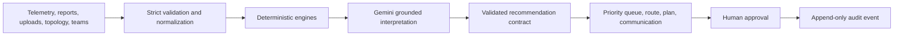

# AegisGrid architecture

## Product boundary

AegisGrid serves one operator: the stadium safety supervisor. It is a decision-support surface, not an autonomous dispatcher. Every operational recommendation remains pending until a supervisor accepts or edits it.

## Input → reasoning → action

Deterministic code owns arithmetic, validation, route calculation, heap ordering, authorization boundaries, persistence, and file limits. Gemini owns semantic interpretation, plausible-duplicate comparison, contradiction synthesis, context-sensitive communication, unfamiliar-schema proposals, and uncertainty-reducing questions. The model receives only source IDs and normalized facts; output is rejected when it cites a source that was not supplied.

## Runtime surfaces

- `app/` contains the operator experience and typed server routes.
- `app/styles/` separates the ordered global cascade by responsibility, while `AppChrome` isolates global navigation, status, and footer semantics from incident workflow state. Command metrics, incident intelligence/response/routing/communication, Data Lab source/mapping/preview, audit persistence, simulation state, and supervisor mutations are each isolated behind focused components or typed hooks; the application shell only composes them.
- `src/lib/risk` calculates the transparent 0–100 baseline.
- `src/lib/incidents` blocks and ranks duplicate candidates, then maintains the binary heap.
- `src/lib/routing` calculates primary, alternate, and naive routes over an adjacency list.
- `app/api/analyze`, `app/api/fuse`, and `app/api/upload` invoke `@google/genai` only on the server; `src/lib/ai` validates output, attempts one constrained repair, and returns an explicit degraded result when unavailable.
- `src/lib/data`, `src/lib/telemetry`, and `src/lib/validation` treat uploads and free text as untrusted data.
- `src/lib/firestore` persists incidents and append-only audit events when Firestore is enabled. Its server-side Firestore `onSnapshot` listeners feed an SSE channel so open supervisor sessions receive incident and audit changes immediately; memory mode remains explicitly session-local.
- `app/api/analyze` returns validated reasoning milestones and the final strict recommendation over SSE. It never streams private chain-of-thought or exposes unvalidated provider text.

## Provider choices verified July 2026

The app uses Google's GA [`@google/genai`](https://ai.google.dev/gemini-api/docs/libraries) package and configures the stable [`gemini-3.1-flash-lite`](https://ai.google.dev/gemini-api/docs/models/gemini-3.1-flash-lite) through `GEMINI_MODEL`. This model ID and structured-output support were rechecked against Google's documentation and verified in production on 2026-07-18. Structured output uses `responseMimeType: application/json` plus `responseJsonSchema`, then strict Zod validation. Per-request `httpOptions.timeout` and bounded retry settings are explicit.

Firestore uses Firebase Admin with Application Default Credentials on Google Cloud, as recommended by the [server setup guide](https://firebase.google.com/docs/admin/setup). Cloud Run deployment stores `GEMINI_API_KEY` in Secret Manager and injects it server-side.

## Runtime and deployment decision

AegisGrid now builds and runs as direct Next.js (`next dev`, `next build --webpack`, and the standalone `server.js` image). The experimental `vinext` 0.0.50 bridge, Wrangler worker entry, parallel Vite configuration, and Sites hosting manifest were removed after the Cloud Run target made them redundant. Webpack is explicit for production builds because it completes deterministic standalone builds in the sandbox and Cloud Build, while the current Turbopack build left a stale lock during verification. This reduces the deployment surface to one framework configuration and one container runtime.

The Cloud Run deployment was successfully completed on 2026-07-16 to the project ID `aegisgrid` and linked to `My Billing Account 1`. The service URL is [https://aegisgrid-2026-799660927467.us-central1.run.app](https://aegisgrid-2026-799660927467.us-central1.run.app).

## Operator visual system

The dark base is functional: a stadium supervisor may monitor this common operating picture for hours in a low-light control room, so the palette limits luminance shifts and eye strain. Color is semantic—cyan means live/selected, vermilion critical, lime verified/available, and amber pending/degraded. Sora is reserved for headings, IBM Plex Sans carries dense operational copy, and IBM Plex Mono aligns IDs, times, scores, and ETAs. The tactical stadium map is the sole high-expression signature element; the surrounding decision, evidence, and audit surfaces stay quiet to reduce the swivel-chair problem rather than recreating it inside one screen.

### Design system palette (hex values)

- **Primary Background**: `--bg` `#071318` · Deep background: `--bg-deep` `#030b0f`
- **Surfaces**: `--surface` `#10242b` · Secondary: `--surface-2` `#142c34` · Raised: `--surface-raised` `#1c3942`
- **Borders**: `--border` `#29434a` · Soft: `--border-soft` `#20383f` · Strong: `--border-strong` `#46636a`
- **Semantic indicators**:
  - Cyan (live / selected / info): `--cyan` `#55c2c3`
  - Vermilion (critical incident / urgent): `--red` `#ff6b5e`
  - Lime (verified state / available team): `--green` `#8ecf82`
  - Amber (pending approval / degraded status): `--amber` `#e8b45b`
- **Typography & text**: `--text` `#f1f6f4` · Soft text: `--text-soft` `#c0ccca` · Muted: `--muted` `#8fa19f`

### Typeface rationale

- **Sora Variable**: A geometric sans-serif chosen for high-visibility UI headings, labels, and status badges. It remains clear and recognizable even at small sizes and high text density.
- **IBM Plex Sans**: The primary body typeface, engineered for neutral readability and structured density in industrial and technical console applications.
- **IBM Plex Mono**: Applied to all tabular numeric readouts, timestamps, incident IDs, and route ETAs to ensure absolute column alignment and prevent character-width jumping during real-time data updates.

Layout follows an 8px grid, a three-tier type hierarchy, and 1px surface borders. Motion is limited to critical-incident arrival, route scanning, and progressive validated reasoning; all are disabled under `prefers-reduced-motion`.

## Risk formula

Each component is normalized to 0–100, then combined from central named weights:

`risk = Σ(component × weight)`

Event phase is one visible normalized component with a configured weight, not a hidden multiplier. The final value is clamped and rounded to 0–100. The interface shows every component and does not overwrite the score with the AI severity. If they disagree, it explains the evidence-grounded reason.

## Complexity

- Binary-heap insert: `O(log n)`
- Binary-heap removal: `O(log n)`
- Peek: `O(1)`
- Candidate blocking: neighbourhood/time-window filtering before semantic comparison
- Dijkstra/A*: `O((V + E) log V)` with adjacency-list edges and the same heap implementation

## Quality gates

Every push must pass Prettier, strict TypeScript, ESLint core-web-vitals, unit/integration coverage, environment validation, a production build, repository-size enforcement, a zero-moderate-or-higher production dependency audit, and Playwright browser checks. Coverage thresholds are executable configuration rather than documentation: 93% statements, 85% branches, 95% functions, and 95% lines across the domain and server-boundary modules.

## Failure semantics

AI failure never fabricates an answer. Risk, telemetry, heap ordering, validation, and routing stay available. Semantic fusion, contradiction synthesis, generated announcements, and AI summaries display “AI analysis unavailable.” Provider messages and secrets are never returned to the browser.
